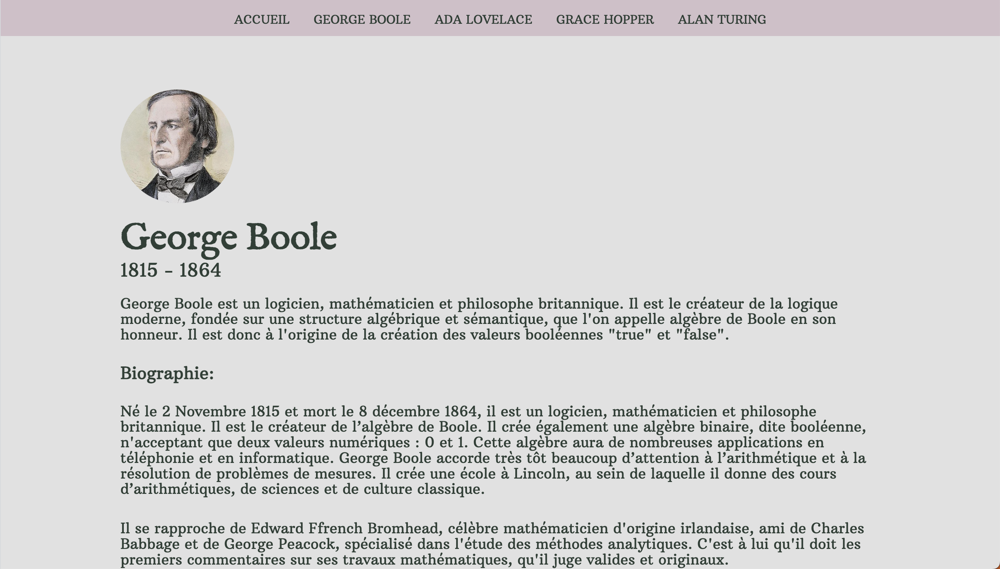

 

  <h1 align="center">People who made things possible</h1>

  

    Welcome to our website, where we showcase the trailblazers of the information age. From Ada Lovelace to Alan Turing, we delve into the stories of those who shaped the way we live, work, and communicate today. Join us on a journey through the history of computing and discover the pioneers who paved the way for the digital world we know today.
     
     
    <a href="https://jesuisleon.github.io/WCS-People-who-made-things-possible/">View Demo</a>
  

## About The Project

Welcome to our website, a project born out of passion, hard work, and a desire to learn. 

Created by four aspiring developers as part of our first project at the Wild Code School, this site was built using only HTML, JS, and CSS. 
In just five short days, we poured our hearts and souls into this project, combining our individual talents and expertise to create a site that we're incredibly proud of. 

Join us as we showcase our skills and take you on a journey through our very first project. We hope you enjoy exploring our site as much as we enjoyed creating it!

## Built With

Love

## Authors

* **Stéphanie** - [Stéphanie](https://github.com/Steph3146)
* **Anaïs** - [Anaïs](https://github.com/curiouseagle)
* **Rosbain** - [Rosbain](https://github.com/russenbissemo)
* **Léon** - [Léon](https://github.com/Jesuisleon)

